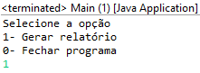

# challenges

Este desafio tem como idéia principal desenvolver um simples algoritmo capaz de buscar um arquivo de dados no formato .dat em um dado diretório do sistema e inserir em um outro diretório a saída da análise realizada sobre os dados.

A idéia desta solução é apresentar um menu que permita ao usuário escolher entre duas opções:
[1] - processar os dados dos arquivos no diretório de input
[0] - sair do programa
[...] - qualquer outra opção encerra o programa retornando para o SO o status -1.

O desenvolvimento tenta garantir que os arquivos lidos sem erro gerem relatórios, e os lidos com erro sejam apenas ignorados. Isso permite que um erro no início do processo não influencie no decorrer da execução.

Ao iniciar o processamento o programa limpa a pasta de saída de dados, evite inserir arquivos extras ou que não devam ser removidos do seu computador.
